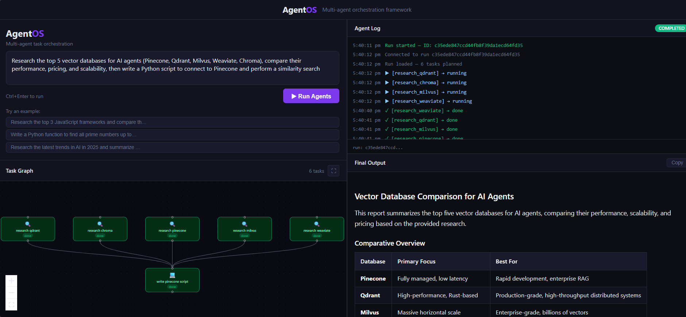

# AgentOS ⚡

AgentOS is a production-grade multi-agent AI orchestration framework. A Planner agent classifies goal complexity, decomposes it into a LangGraph StateGraph of specialized workers — Researcher, Coder, Summarizer, Browser — and executes independent tasks in parallel. Features a 5-model Gemini fallback chain for 99.9% uptime on free-tier quota limits, deep research with BeautifulSoup content extraction and source attribution, self-correcting code execution via sandboxed subprocess, and a real-time React dashboard with live DAG visualization streamed over WebSocket. Stack: LangGraph · FastAPI · Redis · MongoDB · React · Gemini API

---

## 🔗 Live Demo

**Frontend:** https://agentos-frontend.onrender.com

**Backend API:** https://agentos-backend.onrender.com

---

## Demo

> Type a goal → agents plan, execute in parallel, and synthesize in real time



---

## How It Works

```
User submits a goal
       ↓
Planner classifies complexity → simple / moderate / complex
       ↓
Gemini generates a JSON task DAG with dependencies
       ↓
LangGraph StateGraph routes tasks to worker nodes
       ↓
Workers execute in parallel (asyncio.gather)
  Researcher → query extraction → Tavily search → page fetch → BeautifulSoup extract → Gemini summary
  Coder      → code generation → sandboxed subprocess execution → self-correction loop
  Summarizer → map-reduce for large context windows
  Browser    → Playwright page fetch + content extraction
       ↓
Dependency resolution — task3 waits for task1 + task2 automatically
       ↓
Synthesizer merges all outputs → final markdown answer with citations
       ↓
Redis pub/sub streams every state change to React dashboard via WebSocket
```

---

## Features

- **Dynamic agent allocation** — Planner classifies goal complexity first: simple goals get 1 worker, moderate get 2-3, complex get the full pipeline. Eliminates unnecessary API calls for simple questions.
- **LangGraph StateGraph orchestration** — workers are graph nodes, dependencies are edges, conditional routing decides which worker fires next based on task readiness
- **5-model Gemini fallback chain** — starts with gemini-2.5-flash, cascades through 4 fallback models on 429/503/504 errors. 99.9% uptime on free tier quota limits
- **Deep research** — Researcher extracts a focused search query, fetches full page content from top URLs, strips nav/ads/footer with BeautifulSoup, and summarizes clean article text
- **Source attribution** — every researcher output ends with cited sources; synthesizer extracts and consolidates them into the final answer
- **Dependency output injection** — summarizer and synthesizer receive actual upstream outputs, not just task descriptions
- **Self-correcting Coder** — writes Python, executes in a subprocess sandbox, reads the error, fixes the code — up to 3 attempts
- **Live task DAG** — React Flow graph shows every node changing color in real time (pending → running → done)
- **WebSocket streaming** — every task status change streams to the dashboard via Redis pub/sub → FastAPI WebSocket
- **Run history** — completed runs saved to MongoDB, replayable from the sidebar

---

## Architecture

```
┌─────────────────────────────────────────────────────────────┐
│                      React Dashboard                         │
│  GoalInput → TaskDAG (React Flow) → AgentLog → OutputPanel  │
│              RunHistory ← WebSocket streaming               │
└──────────────────────────┬──────────────────────────────────┘
                           │ HTTP + WebSocket
┌──────────────────────────▼──────────────────────────────────┐
│                     FastAPI Backend                          │
│                                                              │
│  POST /goal → Planner (complexity classify → task DAG)      │
│             → LangGraph StateGraph                          │
│                                                              │
│  Nodes:  Researcher │ Coder │ Summarizer │ Browser           │
│  Tools:  web_search │ http_fetch │ code_exec │ file_rw       │
│  Routing: conditional edges based on task readiness          │
│                                                              │
│  Synthesizer → final_output → WebSocket publish             │
└──────────┬──────────────────────────────────┬───────────────┘
           │                                  │
┌──────────▼──────────┐              ┌────────▼────────┐
│    Upstash Redis     │              │  MongoDB Atlas  │
│  task state + pubsub │              │  run history    │
└─────────────────────┘              └─────────────────┘
```

---

## Tech Stack

| Layer | Technology |
|---|---|
| Frontend | React 18, Vite, TypeScript |
| State management | Zustand |
| Task graph UI | React Flow (@xyflow/react) |
| Backend | FastAPI, Python 3.11 |
| Agent orchestration | LangGraph StateGraph |
| LLM | Google Gemini (2.5-flash → 2.5-flash-lite → 2.0-flash → 2.0-flash-lite → 2.5-pro) |
| Task state | Redis (Upstash) |
| Run history | MongoDB (Atlas) |
| Web search | Tavily API |
| HTML extraction | BeautifulSoup4 |
| Deployment | Render (backend + frontend) |

---

## Project Structure

```
AgentOS/
├── backend/
│   ├── agents/
│   │   ├── base.py          # BaseAgent — 5-model fallback chain
│   │   ├── planner.py       # Complexity classifier + dynamic task DAG generator
│   │   ├── researcher.py    # Query extraction → search → page fetch → BS4 extract → summarize
│   │   ├── coder.py         # Code gen + subprocess sandbox + self-correction loop
│   │   ├── summarizer.py    # Map-reduce summarization for large context
│   │   ├── browser.py       # Playwright page fetch + content extraction
│   │   └── synthesizer.py   # Final merge with source attribution
│   ├── graph/
│   │   ├── models.py        # Task, Run, WorkerType, AgentState Pydantic models
│   │   ├── agent_graph.py   # LangGraph StateGraph — nodes, edges, conditional routing
│   │   ├── checkpointer.py  # Redis-backed LangGraph checkpoint — survives restarts
│   │   ├── redis_store.py   # Redis persistence + pub/sub
│   │   ├── task_graph.py    # Thin persistence wrapper over RedisStore
│   │   └── dispatcher.py    # Compiles and invokes the StateGraph per run
│   ├── tools/
│   │   ├── registry.py      # Central tool registry — agents call by name
│   │   ├── web_search.py    # Tavily API wrapper with relevance scoring
│   │   ├── code_exec.py     # Subprocess sandbox with timeout
│   │   ├── http_fetch.py    # Async httpx fetcher
│   │   └── file_rw.py       # Sandboxed file I/O
│   ├── api/
│   │   ├── routes.py        # REST endpoints — POST /goal, GET /runs/{id}
│   │   └── websocket.py     # WebSocket + Redis pub/sub → frontend
│   ├── db/
│   │   └── mongo.py         # MongoDB run history
│   ├── config.py            # Pydantic Settings + model chain
│   └── main.py              # FastAPI app + startup events
├── frontend/
│   └── src/
│       ├── components/
│       │   ├── GoalInput.tsx    # Goal form + example prompts
│       │   ├── TaskDAG.tsx      # React Flow live graph with status colors
│       │   ├── AgentLog.tsx     # Real-time log stream
│       │   ├── OutputPanel.tsx  # Markdown output with copy button
│       │   └── RunHistory.tsx   # Past runs sidebar from MongoDB
│       ├── hooks/
│       │   └── useAgentSocket.ts  # WebSocket hook — parses all event types
│       └── store/
│           └── runStore.ts      # Zustand global state
├── render.yaml
├── docker-compose.yml
└── README.md
```

---

## Getting Started

### Prerequisites

- Python 3.11+
- Node.js 20+
- Google AI Studio API key — free at [aistudio.google.com](https://aistudio.google.com)
- Tavily API key — free at [tavily.com](https://tavily.com) (1000 searches/month)
- Upstash Redis — free at [upstash.com](https://upstash.com)

### 1. Clone the repo

```bash
git clone https://github.com/MaheshRaghava/AgentOS.git
cd AgentOS
```

### 2. Backend setup

```powershell
cd backend
python -m venv .venv
.venv\Scripts\Activate.ps1
pip install -r requirements.txt
cp .env.example .env
# Fill in GEMINI_API_KEY, REDIS_URL, TAVILY_API_KEY
uvicorn main:app --reload --port 8000
```

### 3. Frontend setup

```powershell
cd frontend
npm install
npm run dev
```

### 4. Open the dashboard

```
http://localhost:5173
```

---

## Environment Variables

| Variable | Description | Required |
|---|---|---|
| `GEMINI_API_KEY` | Google AI Studio API key | ✅ |
| `REDIS_URL` | Upstash Redis URL (`rediss://...`) | ✅ |
| `MONGODB_URI` | MongoDB Atlas connection string | ❌ |
| `TAVILY_API_KEY` | Tavily web search API key | ❌ |
| `FRONTEND_URL` | Render frontend URL for CORS | ✅ prod |

---

## Deployment

### Both Backend & Frontend → Render

Render supports both **Python** and **Static Site** deployments from a single repo.

#### Backend (Web Service)

```
Render Dashboard → New → Web Service → Connect GitHub repo
Runtime: Python
Build Command: pip install -r requirements.txt
Start Command: uvicorn main:app --host 0.0.0.0 --port 8000
```

Add all env vars under the **Environment** tab.

#### Frontend (Static Site)

```
Render Dashboard → New → Static Site → Connect GitHub repo
Root Directory: frontend
Build Command: npm install && npm run build
Publish Directory: dist
```

Add env vars:
```
VITE_API_URL=https://agentos-backend.onrender.com
VITE_WS_URL=wss://agentos-backend.onrender.com
```

> ⚡ **Free tier note:** Both services spin down after 15 minutes of inactivity. Add [UptimeRobot](https://uptimerobot.com) pointing to `/health` to keep the backend warm.

---

## Demo Goals to Try

```
Research the top 3 JavaScript frameworks and compare their pros and cons

Write a Python function to implement merge sort and explain the time complexity

Research the latest AI model releases in 2025 and summarize key developments

Research quantum computing and explain it like I'm a software engineer

Compare AWS, Azure, and Google Cloud for a startup choosing cloud infrastructure
```

---

## Architecture Decisions

**Why LangGraph over a custom dispatcher?**
LangGraph's StateGraph models the task DAG natively — nodes are workers, edges encode dependencies, conditional routing decides what runs next. This replaces ~150 lines of custom asyncio loop logic with a declarative graph definition that's easier to reason about and extend.

**Why dynamic complexity classification?**
A fixed pipeline that always spawns 5 agents wastes quota and adds latency for simple questions. The classifier call costs ~50 tokens and saves 4 unnecessary LLM calls for "What is React?" — reducing response time from ~15s to ~3s for simple goals.

**Why a 5-model fallback chain?**
The free tier caps each model at 20-1500 req/day depending on the model. By chaining 5 models with separate quotas, AgentOS effectively multiplies its daily capacity by 5 and survives individual model outages automatically.

**Why BeautifulSoup for page extraction?**
Raw `body` text from pages contains nav menus, cookie banners, and ads before the actual content. Extracting `<article>` or `<main>` tags gives 5x more relevant content per token sent to the LLM.

**Why Redis for both task state and pub/sub?**
Single infrastructure for two purposes — task graph persistence and real-time WebSocket events. Redis pub/sub is the bridge between the background dispatcher and the WebSocket handler, enabling true real-time streaming without polling.

---

## What This Demonstrates

Multi-agent orchestration is the most in-demand AI engineering skill in 2025. Most portfolio projects just wrap a single LLM call. AgentOS shows you understand:

- **DAG-based task planning** — not sequential prompts
- **LangGraph StateGraph** — real framework usage, not custom loops
- **Async parallel execution** — workers run concurrently, dispatcher handles ordering
- **State persistence** — Redis-backed task graph survives restarts
- **Real-time streaming** — WebSocket + pub/sub, not polling
- **Self-correcting agents** — Coder retries with error context
- **Model resilience** — 5-model fallback chain, timeout handling
- **Production infra** — Render (both services) + Upstash + Atlas

---

## Author

**Mahesh Raghava**
- GitHub: [@MaheshRaghava](https://github.com/MaheshRaghava)
- LinkedIn: [linkedin.com/in/mahesh-raghava](https://linkedin.com/in/mahesh-raghava)
- Email: maheshraghavak@gmail.com

---

## License

MIT License — fork, extend, build on top of this.